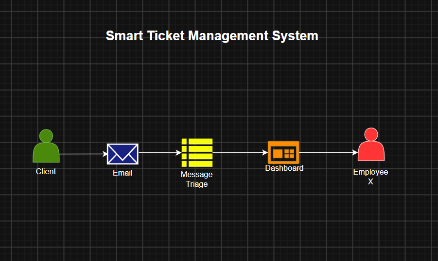

# Smart Ticket Management System

This application is a smart ticket management system that takes tickets from emails and automatically process and assign the task to the appropriate team(s) and employee(s).

### Stakeholders:

- `Customer (Requester)`: External clients who submit support requests through emails.
- `Employee (Support Agent)`: Internal staff responsible for reviewing, updating and closing assigned tickets.
- `System Admin`: Internal staff responsible for creating and managing tickets, employee records and teams.
- `AI Agent`: The AI agent responsible to handling ticket triage and managing communications between customers and staff.

### Function Requirements:

- `Ticket Creation`: The system must get tickets recieved through emails and automatically assign a unique ID along with subject, description, priority level and original message.
- `Ticket Triage`: The system must automatically assign the created ticket to the appropriate team.
- `Employee Roles Management`: The system must be able to create employees with their unique ID, name, team(s).
- `Team Management`: The system must let admin to create and manage teams.
- `Communication`: The system must be able to collect, respond and notify to tickets in email, and it must be able to send, manage and notify tickets in the team dashboard.

### Non-functional Requirement:

- `Connectors`: The system should reliably be connected to email service and the dashboard.
- `Data Encryption`: All data related to the ticket must encrypted in transit using TLS and at rest using AES.

### System Design:

### Database Design:

### Technical Stack:

- `Backend`: Java, Spring Boot, Spring Security, Spring Data
- `Database`: PostgreSQL
